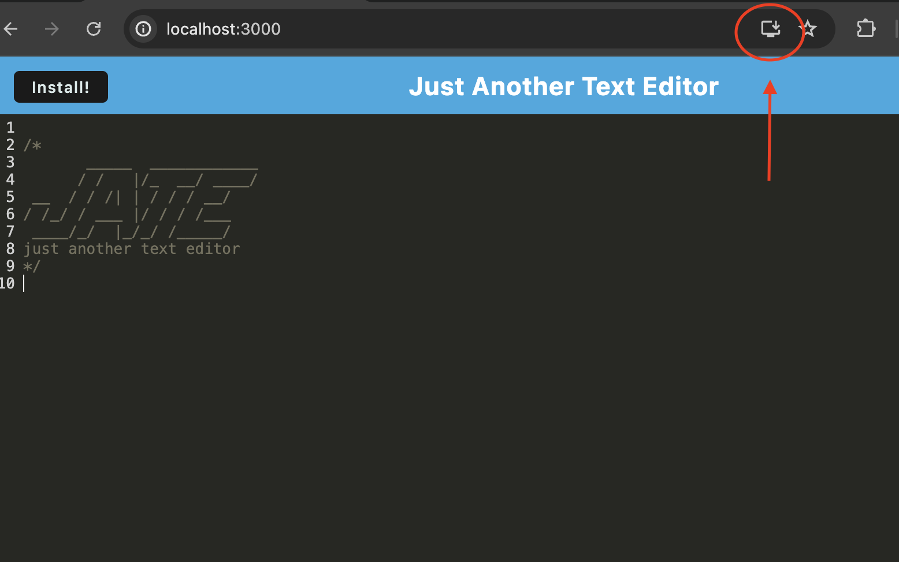

# PWA text editor

## Description

I added functionality to this text editing app so that I could learn more about PWA's, how to cache assets, and how to bundle files to optimize content delivery on the web. This project is just a simple text editor, but I can use the skills I learned to make my future apps more robust. I think that PWAs expand the scope of apps that I am able to build and provide a very interesting approach to create downloadable apps for users on a variety of operating systems.

## Installation

To get the development enviroment up and running, navigate to the root directory in the terminal (same level as this README). Enter `npm i` to install dependencies, `npm run build` to run the webpack build process, and then `npm run start:dev` to start running a local instance on [localhost:3000](http://localhost:3000).

## Usage

Once you have set up your development enviroment and have navigated to [localhost:3000](http://localhost:3000), you can now use the app offline from the browser if you wish, or install it as a standalone app. To install as a standalone application click the button shown in the screenshot (if on chrome). 
